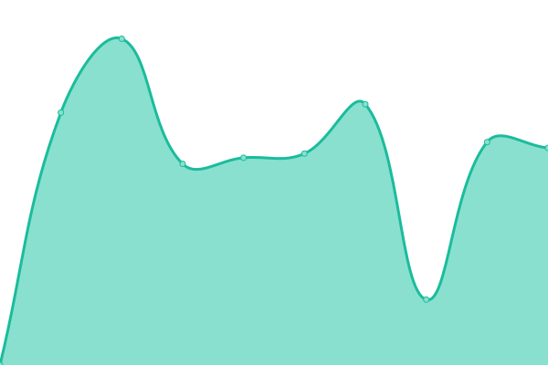

# [📈 Live Status](https://medishd.github.io/shd-service-status): <!--live status--> **🟧 Partial outage**

This repository contains the open-source uptime monitor and status page for [medishd](https://medishd.github.io/shd-service-status), powered by [Upptime](https://github.com/upptime/upptime).

With [Upptime](https://upptime.js.org), you can get your own unlimited and free uptime monitor and status page, powered entirely by a GitHub repository. We use [Issues](https://github.com/medishd/shd-service-status/issues) as incident reports, [Actions](https://github.com/medishd/shd-service-status/actions) as uptime monitors, and [Pages](https://medishd.github.io/shd-service-status) for the status page.

<!--start: status pages-->
<!-- This summary is generated by Upptime (https://github.com/upptime/upptime) -->
<!-- Do not edit this manually, your changes will be overwritten -->
<!-- prettier-ignore -->
| URL | Status | History | Response Time | Uptime |
| --- | ------ | ------- | ------------- | ------ |
|  [Media Shd.](https://www.mediashd.com) | 🟩 Up | [media-shd.yml](https://github.com/mediashd/shd-service-status/commits/HEAD/history/media-shd.yml) | 

 2240ms
     
 | 

<a href="https://mediashd.github.io/shd-service-status/history/media-shd">99.89%</a>
    

|  [ISNAD Citation Style](https://isnadsistemi.org) | 🟩 Up | [isnad-citation-style.yml](https://github.com/mediashd/shd-service-status/commits/HEAD/history/isnad-citation-style.yml) | 

 4838ms
     
 | 

<a href="https://mediashd.github.io/shd-service-status/history/isnad-citation-style">99.90%</a>
    

|  [OJS Services](https://ojs.mediashd.com) | 🟥 Down | [ojs-services.yml](https://github.com/mediashd/shd-service-status/commits/HEAD/history/ojs-services.yml) | 

 696ms
     
 | 

<a href="https://mediashd.github.io/shd-service-status/history/ojs-services">0.00%</a>
    

|  [Yazım Desteği](https://yazimdestegi.com) | 🟩 Up | [yazim-destegi.yml](https://github.com/mediashd/shd-service-status/commits/HEAD/history/yazim-destegi.yml) | 

 5839ms
     
 | 

<a href="https://mediashd.github.io/shd-service-status/history/yazim-destegi">99.53%</a>
    

|  [Oku Okut](https://okuokut.org) | 🟩 Up | [oku-okut.yml](https://github.com/mediashd/shd-service-status/commits/HEAD/history/oku-okut.yml) | 

 6003ms
     
 | 

<a href="https://mediashd.github.io/shd-service-status/history/oku-okut">98.96%</a>
    

|  [Oku Okut Publishing](https://yayin.okuokut.org) | 🟩 Up | [oku-okut-publishing.yml](https://github.com/mediashd/shd-service-status/commits/HEAD/history/oku-okut-publishing.yml) | 

 3468ms
     
 | 

<a href="https://mediashd.github.io/shd-service-status/history/oku-okut-publishing">99.35%</a>
    

|  [TSBS](https://sempozyum.okuokut.org) | 🟩 Up | [tsbs.yml](https://github.com/mediashd/shd-service-status/commits/HEAD/history/tsbs.yml) | 

 2612ms
     
 | 

<a href="https://mediashd.github.io/shd-service-status/history/tsbs">99.16%</a>
    

<!--end: status pages-->

[**Visit our status website →**](https://medishd.github.io/shd-service-status)

## 📄 License

- Powered by: [Upptime](https://github.com/upptime/upptime)
- Code: [MIT](./LICENSE) © [Anand Chowdhary](https://anandchowdhary.com), supported by [Pabio](https://pabio.com)
- Data in the `./history` directory: [Open Database License](https://opendatacommons.org/licenses/odbl/1-0/)
